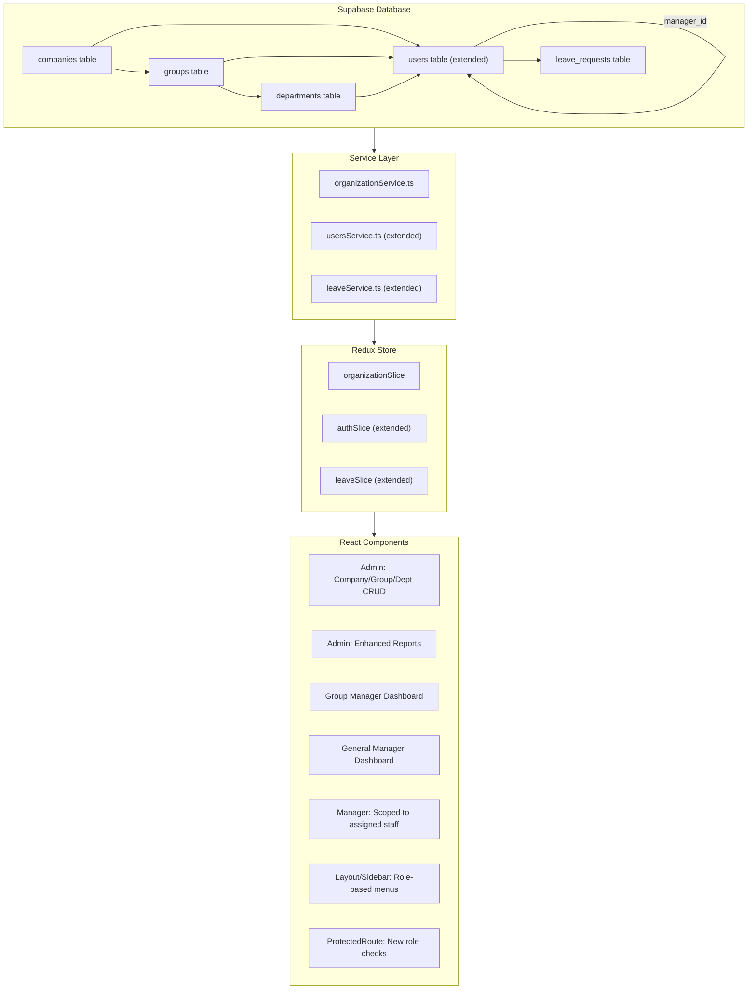
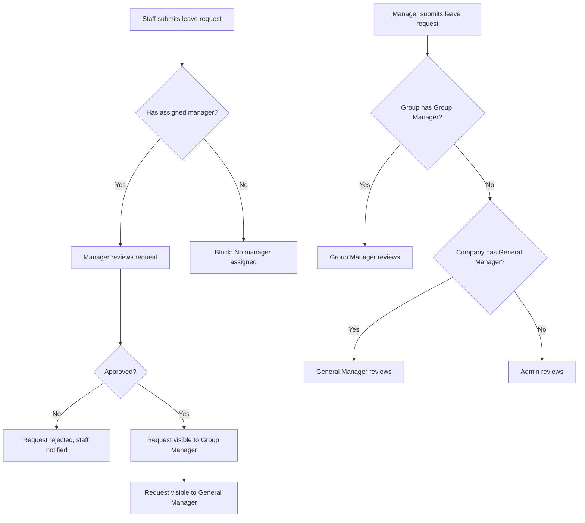

# Design Document: Staff Group Management

## Overview

This design introduces organizational hierarchy (Company → Group → Department) and extended role management (Group Manager, General Manager) into the existing Leave Management System. The current system uses boolean flags (`is_manager`, `is_admin`) on the `users` table and has no concept of organizational structure. This feature replaces those booleans with a single `role` enum field, adds three new Supabase tables (`companies`, `groups`, `departments`), adds foreign keys on `users` for `company_id`, `group_id`, `department_id`, and `manager_id`, and introduces role-specific dashboards, approval chains, and admin CRUD screens.

The design preserves the existing React/TypeScript + Supabase + Redux + Material UI stack. New components follow the same patterns already established in the codebase (service layer → Redux slice → component).

## Architecture

The feature touches four layers of the application:



### Key Architectural Decisions

1. **Single `role` enum replaces booleans**: Instead of `is_manager` + `is_admin`, a single `role` column with values `staff | manager | group_manager | general_manager | admin` simplifies role checks and avoids ambiguous flag combinations. A database migration maps existing boolean values to the new enum.

2. **Cascading dropdown pattern for org assignment**: When editing a user, selecting a Company filters Groups, selecting a Group filters Departments. This uses dependent queries in the service layer rather than loading all data upfront.

3. **Manager scoping via `manager_id`**: Managers see only their assigned staff. This is enforced at the query level (`.eq('manager_id', currentUser.id)`) rather than RLS, keeping the approach consistent with the existing codebase which uses client-side Supabase queries.

4. **Approval routing logic in the service layer**: The approval chain (Staff→Manager, Manager→Group Manager, fallback to General Manager/Admin) is implemented in `leaveService.ts` as a resolver function, not hardcoded in components.

## Components and Interfaces

### New Service: `organizationService.ts`

```typescript
export const OrganizationService = {
  // Companies
  getCompanies(): Promise<Company[]>;
  createCompany(name: string): Promise<Company>;
  updateCompany(id: string, name: string): Promise<Company>;
  deleteCompany(id: string): Promise<void>; // fails if users assigned
  
  // Groups
  getGroups(companyId?: string): Promise<Group[]>;
  createGroup(name: string, companyId: string): Promise<Group>;
  updateGroup(id: string, name: string): Promise<Group>;
  deleteGroup(id: string): Promise<void>; // fails if users assigned
  
  // Departments
  getDepartments(groupId?: string): Promise<Department[]>;
  createDepartment(name: string, groupId: string): Promise<Department>;
  updateDepartment(id: string, name: string): Promise<Department>;
  deleteDepartment(id: string): Promise<void>; // fails if users assigned
};
```

### Extended Service: `leaveService.ts`

```typescript
// New method to resolve the approver for a leave request
resolveApprover(userId: string): Promise<{ approverId: string; approverRole: string }>;

// New method to get leave requests scoped by role
getRequestsByScope(
  currentUser: User,
  filters?: LeaveRequestFilters
): Promise<{ data: LeaveRequest[]; count: number }>;
```

### New Redux Slice: `organizationSlice.ts`

```typescript
interface OrganizationState {
  companies: Company[];
  groups: Group[];
  departments: Department[];
  loading: boolean;
  error: string | null;
}
```

### New/Modified Components

| Component | Path | Purpose |
|-----------|------|---------|
| `CompanyManagement` | `src/components/admin/Companies/index.tsx` | CRUD for companies |
| `GroupManagement` | `src/components/admin/Groups/index.tsx` | CRUD for groups (filtered by company) |
| `DepartmentManagement` | `src/components/admin/Departments/index.tsx` | CRUD for departments (filtered by group) |
| `GroupManagerDashboard` | `src/components/group-manager/Dashboard.tsx` | Group-scoped dashboard |
| `GroupManagerApprovals` | `src/components/group-manager/Approvals/index.tsx` | Approve manager leave within group |
| `GroupManagerTeamView` | `src/components/group-manager/TeamView/index.tsx` | Group-wide calendar |
| `GroupManagerBalances` | `src/components/group-manager/Balances/index.tsx` | Group-wide balances |
| `GeneralManagerDashboard` | `src/components/general-manager/Dashboard.tsx` | Company-wide dashboard |
| `GeneralManagerLeaveView` | `src/components/general-manager/LeaveView/index.tsx` | Company-wide leave view |
| `Layout` (modified) | `src/components/common/Layout/index.tsx` | Add Group Manager and General Manager sidebar sections |
| `ProtectedRoute` (modified) | `src/components/common/ProtectedRoute.tsx` | Add `requireGroupManager` and `requireGeneralManager` props |
| `Users` (modified) | `src/components/admin/Users/index.tsx` | Add company/group/department/role/manager dropdowns |
| `ManagerDashboard` (modified) | `src/components/manager/Dashboard.tsx` | Scope to `manager_id` assigned staff |

### Approval Chain Flow



## Data Models

### New Types (`src/types/index.ts`)

```typescript
export type UserRole = 'staff' | 'manager' | 'group_manager' | 'general_manager' | 'admin';

export interface Company {
  id: string;
  name: string;
  created_at: string;
}

export interface Group {
  id: string;
  name: string;
  company_id: string;
  created_at: string;
}

export interface Department {
  id: string;
  name: string;
  group_id: string;
  created_at: string;
}
```

### Extended User Type

```typescript
export interface User {
  id: string;
  email: string;
  full_name: string;
  phone?: string;
  hire_date: string;
  role: UserRole;              // replaces is_manager + is_admin
  company_id?: string;
  group_id?: string;
  department_id?: string;
  manager_id?: string;         // FK to users.id (the assigned manager)
  requires_password_change: boolean;
  created_at: string;
  updated_at: string;
  // Deprecated (kept for migration compatibility):
  is_manager: boolean;
  is_admin: boolean;
}
```

### Database Schema Changes

```sql
-- New tables
CREATE TABLE companies (
  id UUID PRIMARY KEY DEFAULT gen_random_uuid(),
  name TEXT NOT NULL,
  created_at TIMESTAMPTZ DEFAULT now()
);

CREATE TABLE groups (
  id UUID PRIMARY KEY DEFAULT gen_random_uuid(),
  name TEXT NOT NULL,
  company_id UUID NOT NULL REFERENCES companies(id),
  created_at TIMESTAMPTZ DEFAULT now()
);

CREATE TABLE departments (
  id UUID PRIMARY KEY DEFAULT gen_random_uuid(),
  name TEXT NOT NULL,
  group_id UUID NOT NULL REFERENCES groups(id),
  created_at TIMESTAMPTZ DEFAULT now()
);

-- Users table alterations
ALTER TABLE users
  ADD COLUMN role TEXT NOT NULL DEFAULT 'staff'
    CHECK (role IN ('staff', 'manager', 'group_manager', 'general_manager', 'admin')),
  ADD COLUMN company_id UUID REFERENCES companies(id),
  ADD COLUMN group_id UUID REFERENCES groups(id),
  ADD COLUMN department_id UUID REFERENCES departments(id),
  ADD COLUMN manager_id UUID REFERENCES users(id);

-- Migration: map existing booleans to role
UPDATE users SET role = 'admin' WHERE is_admin = true;
UPDATE users SET role = 'manager' WHERE is_manager = true AND is_admin = false;
UPDATE users SET role = 'staff' WHERE is_manager = false AND is_admin = false;
```

### Role Helper Utility

A utility function replaces scattered boolean checks throughout the codebase:

```typescript
// src/utils/roles.ts
export const isAdmin = (user: User) => user.role === 'admin';
export const isManager = (user: User) => user.role === 'manager';
export const isGroupManager = (user: User) => user.role === 'group_manager';
export const isGeneralManager = (user: User) => user.role === 'general_manager';
export const isStaff = (user: User) => user.role === 'staff';
export const canApproveLeave = (user: User) => 
  ['manager', 'group_manager', 'general_manager', 'admin'].includes(user.role);
```

