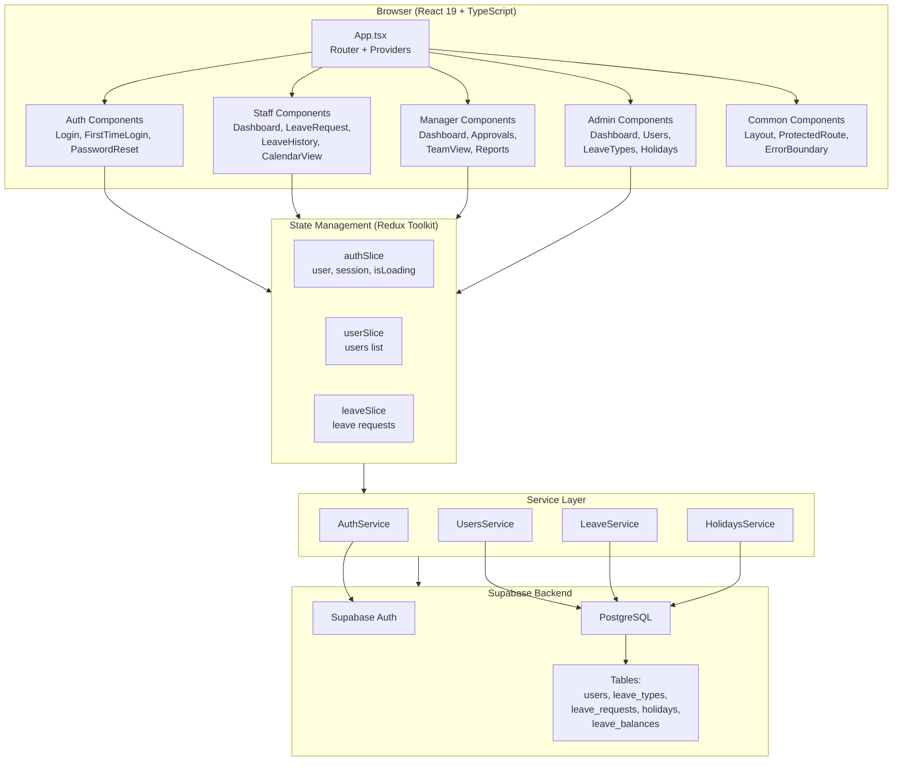
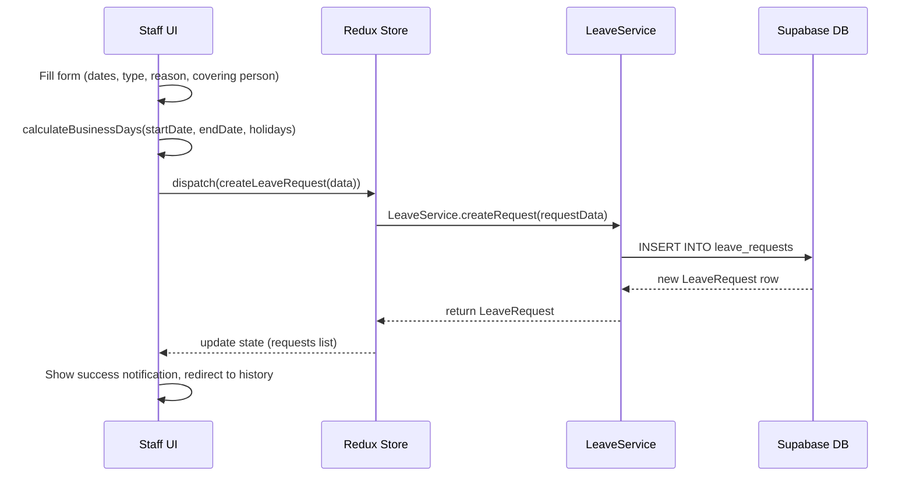
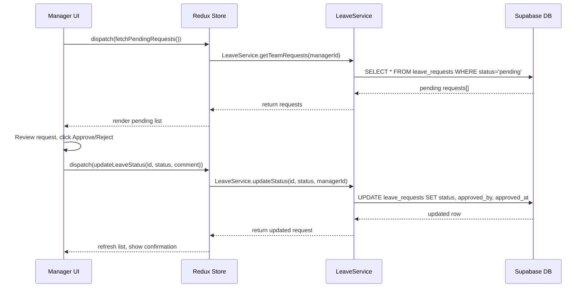
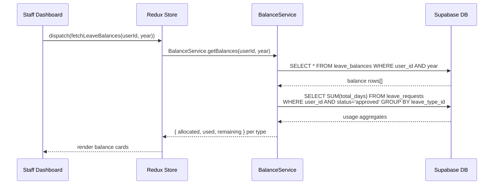

# Design Document: Absenta — Staff Leave Management System

## Overview

Absenta is a web-based staff leave management application built with React 19, TypeScript, Material-UI 7, Redux Toolkit, and Supabase as the backend-as-a-service. The system supports three user roles — Staff, Manager, and Admin — each with distinct capabilities governed by role-based access control.

The application currently has a functional Admin module (user management, leave types, authentication) but Staff and Manager features remain as stubs. This design covers the complete implementation of all remaining features across four phases: Staff core features, Manager workflows, Admin polish, and system-wide enhancements including leave balance tracking, notifications, and real-time updates.

The architecture follows a service-layer pattern where all Supabase interactions are encapsulated in dedicated service modules, Redux Toolkit manages client-side state via async thunks, and React Router DOM 7 handles role-based routing with protected route guards.

## Architecture



## Sequence Diagrams

### Leave Request Submission Flow



### Leave Approval Flow



### Leave Balance Calculation Flow



## Components and Interfaces

### Component 1: ProtectedRoute (Existing — Needs Extension)

**Purpose**: Guards routes based on authentication state and user role. Currently supports `requireAdmin` and `requireManager` flags.

```typescript
interface ProtectedRouteProps {
  children: React.ReactNode;
  requireAdmin?: boolean;
  requireManager?: boolean;
  requireStaff?: boolean; // NEW: explicit staff-only guard
}
```

**Responsibilities**:
- Redirect unauthenticated users to `/login`
- Enforce first-time password change redirect
- Block access based on role flags
- Route staff/manager/admin to their respective dashboards on role mismatch

### Component 2: StaffDashboard

**Purpose**: Landing page for staff users showing leave balances, recent requests, and quick actions.

```typescript
interface LeaveBalance {
  leave_type_id: string;
  leave_type_name: string;
  color_code: string;
  allocated: number;
  used: number;
  pending: number;
  remaining: number;
}

interface StaffDashboardProps {}
// Uses Redux state: auth.user, leave.requests, leave.balances
```

**Responsibilities**:
- Display leave balance cards per leave type (allocated / used / remaining)
- Show recent leave requests (last 5) with status chips
- Provide quick-apply button navigating to `/staff/request`
- Show upcoming holidays

### Component 3: LeaveRequestForm

**Purpose**: Form for submitting new leave requests with date validation, business day calculation, and half-day support.

```typescript
interface LeaveRequestFormData {
  leaveTypeId: string;
  startDate: Date;
  endDate: Date;
  isHalfDay: boolean;
  halfDayPeriod?: 'morning' | 'afternoon';
  reason?: string;
  coveringPersonId?: string;
}

interface LeaveRequestFormProps {
  leaveTypes: LeaveType[];
  colleagues: User[];
  holidays: Holiday[];
  onSubmit: (data: LeaveRequestFormData) => Promise<void>;
}
```

**Responsibilities**:
- Date range picker with weekend/holiday exclusion
- Leave type selector (active types only)
- Half-day toggle with morning/afternoon selection
- Business day calculation displayed in real-time
- Covering person dropdown (optional)
- Reason text field (max 500 chars)
- Balance validation before submission

### Component 4: LeaveHistory

**Purpose**: Filterable, sortable table of the user's leave requests with cancel action for pending items.

```typescript
interface LeaveHistoryFilters {
  status?: LeaveRequest['status'];
  leaveTypeId?: string;
  dateRange?: { start: Date; end: Date };
}

interface LeaveHistoryProps {}
// Uses Redux state: auth.user.id, leave.requests
```

**Responsibilities**:
- Paginated table with columns: dates, type, days, status, actions
- Filter by status, leave type, date range
- Sort by date, status
- Cancel action for pending requests (with confirmation dialog)
- Status chips color-coded (pending=orange, approved=green, rejected=red, cancelled=grey)

### Component 5: CalendarView

**Purpose**: Visual calendar showing approved leaves and public holidays using react-big-calendar.

```typescript
interface CalendarEvent {
  id: string;
  title: string;
  start: Date;
  end: Date;
  allDay: boolean;
  resource: {
    type: 'leave' | 'holiday';
    color: string;
    status?: LeaveRequest['status'];
  };
}

interface CalendarViewProps {}
// Uses Redux state: leave.requests, holidays
```

**Responsibilities**:
- Month/week/day views via react-big-calendar
- Color-coded events by leave type (using `color_code`)
- Holidays displayed as distinct events
- Click event to view leave request details
- Legend showing leave type colors

### Component 6: ManagerDashboard

**Purpose**: Overview for managers showing team stats, pending approval count, and team availability.

```typescript
interface TeamStats {
  totalMembers: number;
  onLeaveToday: number;
  pendingApprovals: number;
  upcomingLeaves: number;
}
```

**Responsibilities**:
- Summary cards: team size, on leave today, pending approvals, upcoming leaves
- Quick link to approvals page
- Team availability mini-calendar for current week

### Component 7: Approvals

**Purpose**: List of pending leave requests from team members with approve/reject actions.

```typescript
interface ApprovalAction {
  requestId: string;
  action: 'approved' | 'rejected';
  comment?: string;
}
```

**Responsibilities**:
- List pending requests with employee name, dates, type, days, reason
- Approve/reject buttons with optional comment dialog
- Batch approve capability
- Filter by employee, leave type
- Show requester's remaining balance for context

### Component 8: TeamView

**Purpose**: Calendar or table showing team members' leave schedules with conflict detection.

**Responsibilities**:
- Team calendar view (react-big-calendar) with all team members' approved/pending leaves
- Conflict detection: highlight dates where multiple team members are off
- Filter by team member
- Export team schedule

### Component 9: Reports

**Purpose**: Leave usage statistics with charts and exportable data.

**Responsibilities**:
- Charts: leave usage per employee, per leave type, per month
- Summary statistics: total days taken, most used leave type, peak leave periods
- Date range filter
- Export to CSV

### Component 10: HolidaysManagement

**Purpose**: CRUD interface for public holidays (service layer exists, UI is a stub).

```typescript
interface HolidayFormData {
  name: string;
  holiday_date: string;
  description?: string;
  is_recurring: boolean;
}
```

**Responsibilities**:
- List holidays in a table sorted by date
- Add/edit/delete holidays via dialog
- Recurring holiday toggle
- Import holidays (optional enhancement)

### Component 11: ProfilePage

**Purpose**: View and edit own profile, change password.

**Responsibilities**:
- Display user info (name, email, phone, hire date)
- Edit name, phone
- Change password (current + new + confirm)
- Show role badges (Staff/Manager/Admin)

## Data Models

### Existing Models (from `src/types/index.ts`)

```typescript
interface User {
  id: string;
  email: string;
  full_name: string;
  phone?: string;
  hire_date: string;
  is_manager: boolean;
  is_admin: boolean;
  requires_password_change: boolean;
  created_at: string;
  updated_at: string;
}

interface LeaveType {
  id: string;
  name: string;
  description?: string;
  default_days: number;
  color_code: string;
  is_active: boolean;
}

interface LeaveRequest {
  id: string;
  user_id: string;
  leave_type_id: string;
  start_date: string;
  end_date: string;
  is_half_day: boolean;
  half_day_period?: 'morning' | 'afternoon';
  total_days: number;
  status: 'pending' | 'approved' | 'rejected' | 'cancelled';
  reason?: string;
  covering_person_id?: string;
  approved_by?: string;
  approved_at?: string;
  created_at: string;
  leave_type?: LeaveType;
  user?: User;
}

interface Holiday {
  id: string;
  holiday_date: string;
  name: string;
  description?: string;
  is_recurring: boolean;
}
```

**Validation Rules (Existing)**:
- Email: valid format, required
- Password: min 8 chars, 1 uppercase, 1 lowercase, 1 number
- Leave request: leave type required, start date required, end date >= start date, reason max 500 chars

### New Model: LeaveBalance

```typescript
interface LeaveBalance {
  id: string;
  user_id: string;
  leave_type_id: string;
  year: number;
  allocated_days: number;
  used_days: number;       // computed from approved requests
  pending_days: number;    // computed from pending requests
  carried_over: number;    // days carried from previous year
  created_at: string;
  updated_at: string;
}
```

**SQL Schema**:
```sql
CREATE TABLE public.leave_balances (
  id UUID PRIMARY KEY DEFAULT gen_random_uuid(),
  user_id UUID NOT NULL REFERENCES public.users(id),
  leave_type_id UUID NOT NULL REFERENCES public.leave_types(id),
  year INTEGER NOT NULL,
  allocated_days NUMERIC NOT NULL DEFAULT 0,
  carried_over NUMERIC NOT NULL DEFAULT 0,
  created_at TIMESTAMPTZ DEFAULT NOW(),
  updated_at TIMESTAMPTZ DEFAULT NOW(),
  UNIQUE(user_id, leave_type_id, year)
);
```

**Validation Rules**:
- `year` must be current or future year for new allocations
- `allocated_days` >= 0
- `carried_over` >= 0
- One record per user per leave type per year (unique constraint)
- `used_days` and `pending_days` are computed at query time from `leave_requests`

### Extended Model: LeaveRequest (Approval Comment)

```typescript
interface LeaveRequest {
  // ... existing fields ...
  approval_comment?: string; // NEW: manager's comment on approve/reject
}
```

## Key Functions with Formal Specifications

### Function 1: calculateBusinessDays (Enhanced)

```typescript
function calculateBusinessDays(
  startDate: Date,
  endDate: Date,
  holidays: Holiday[]
): number
```

**Preconditions:**
- `startDate` and `endDate` are valid Date objects
- `startDate <= endDate`
- `holidays` is an array (may be empty)

**Postconditions:**
- Returns a non-negative integer
- Result excludes Saturdays, Sundays, and dates matching any holiday in `holidays`
- If `startDate === endDate` and it's a business day, returns 1
- If `startDate === endDate` and it's a weekend/holiday, returns 0

**Loop Invariants:**
- `count` always equals the number of business days found between `startDate` and the current iteration date (exclusive of weekends and holidays)

### Function 2: getLeaveBalance

```typescript
async function getLeaveBalance(
  userId: string,
  leaveTypeId: string,
  year: number
): Promise<{ allocated: number; used: number; pending: number; remaining: number }>
```

**Preconditions:**
- `userId` is a valid UUID referencing an existing user
- `leaveTypeId` is a valid UUID referencing an active leave type
- `year` is a positive integer (e.g. 2024, 2025)

**Postconditions:**
- `allocated` = `leave_balances.allocated_days + leave_balances.carried_over` for the given user/type/year
- `used` = SUM(`total_days`) of approved leave requests for the user/type within the year
- `pending` = SUM(`total_days`) of pending leave requests for the user/type within the year
- `remaining` = `allocated - used - pending`
- `remaining` may be negative (over-allocation is allowed but flagged in UI)

### Function 3: submitLeaveRequest

```typescript
async function submitLeaveRequest(
  data: LeaveRequestFormData,
  userId: string,
  holidays: Holiday[]
): Promise<LeaveRequest>
```

**Preconditions:**
- `userId` is authenticated and exists in `users` table
- `data.leaveTypeId` references an active leave type
- `data.startDate <= data.endDate`
- If `data.isHalfDay === true`, then `data.startDate === data.endDate` and `data.halfDayPeriod` is defined
- Calculated business days > 0

**Postconditions:**
- A new row is inserted into `leave_requests` with `status = 'pending'`
- `total_days` is correctly computed via `calculateBusinessDays` (or 0.5 for half-day)
- Returns the created `LeaveRequest` object with generated `id` and `created_at`

### Function 4: updateLeaveStatus

```typescript
async function updateLeaveStatus(
  requestId: string,
  newStatus: 'approved' | 'rejected',
  managerId: string,
  comment?: string
): Promise<LeaveRequest>
```

**Preconditions:**
- `requestId` references an existing leave request with `status === 'pending'`
- `managerId` is a valid user with `is_manager === true` or `is_admin === true`
- `newStatus` is either `'approved'` or `'rejected'`

**Postconditions:**
- `leave_requests.status` is updated to `newStatus`
- `approved_by` is set to `managerId`
- `approved_at` is set to current timestamp
- `approval_comment` is set if provided
- Returns the updated `LeaveRequest`

### Function 5: cancelLeaveRequest

```typescript
async function cancelLeaveRequest(
  requestId: string,
  userId: string
): Promise<LeaveRequest>
```

**Preconditions:**
- `requestId` references an existing leave request
- `leave_requests.user_id === userId` (user can only cancel own requests)
- `leave_requests.status === 'pending'` (only pending requests can be cancelled)

**Postconditions:**
- `leave_requests.status` is updated to `'cancelled'`
- Returns the updated `LeaveRequest`

### Function 6: getTeamRequests

```typescript
async function getTeamRequests(
  managerId: string,
  filters?: { status?: string; userId?: string }
): Promise<LeaveRequest[]>
```

**Preconditions:**
- `managerId` references a user with `is_manager === true` or `is_admin === true`

**Postconditions:**
- Returns leave requests from all non-admin, non-manager users (or filtered subset)
- Results include joined `user` and `leave_type` data
- Ordered by `created_at` descending

## Algorithmic Pseudocode

### Business Day Calculation (Holiday-Aware)

```typescript
function calculateBusinessDays(
  startDate: Date,
  endDate: Date,
  holidays: Holiday[]
): number {
  // Build a Set of holiday date strings for O(1) lookup
  const holidaySet = new Set<string>();
  for (const h of holidays) {
    holidaySet.add(h.holiday_date); // format: 'YYYY-MM-DD'
  }

  let count = 0;
  const current = new Date(startDate);

  // LOOP INVARIANT: count = number of business days in [startDate, current)
  while (current <= endDate) {
    const dayOfWeek = current.getDay();
    const dateStr = current.toISOString().split('T')[0];

    const isWeekend = dayOfWeek === 0 || dayOfWeek === 6;
    const isHoliday = holidaySet.has(dateStr);

    if (!isWeekend && !isHoliday) {
      count++;
    }

    current.setDate(current.getDate() + 1);
  }

  return count;
}
```

### Role-Based Route Resolution

```typescript
function resolveDefaultRoute(user: User): string {
  // PRECONDITION: user is authenticated and not null
  // POSTCONDITION: returns the appropriate dashboard path for the user's role

  if (user.is_admin) {
    return '/';                    // Admin dashboard at root
  } else if (user.is_manager) {
    return '/manager/dashboard';   // Manager dashboard
  } else {
    return '/staff/dashboard';     // Staff dashboard
  }
}
```

### Leave Balance Computation

```typescript
async function computeLeaveBalances(
  userId: string,
  year: number,
  leaveTypes: LeaveType[],
  balanceRecords: LeaveBalance[],
  requests: LeaveRequest[]
): LeaveBalanceSummary[] {
  // PRECONDITION: all arrays are defined, year > 0
  // POSTCONDITION: returns one summary per active leave type

  const summaries: LeaveBalanceSummary[] = [];

  for (const lt of leaveTypes) {
    if (!lt.is_active) continue;

    const balanceRecord = balanceRecords.find(
      b => b.leave_type_id === lt.id && b.year === year
    );

    const allocated = (balanceRecord?.allocated_days ?? lt.default_days)
                    + (balanceRecord?.carried_over ?? 0);

    const yearRequests = requests.filter(
      r => r.leave_type_id === lt.id
        && new Date(r.start_date).getFullYear() === year
    );

    const used = yearRequests
      .filter(r => r.status === 'approved')
      .reduce((sum, r) => sum + r.total_days, 0);

    const pending = yearRequests
      .filter(r => r.status === 'pending')
      .reduce((sum, r) => sum + r.total_days, 0);

    summaries.push({
      leave_type_id: lt.id,
      leave_type_name: lt.name,
      color_code: lt.color_code,
      allocated,
      used,
      pending,
      remaining: allocated - used - pending,
    });
  }

  return summaries;
}
```

## Example Usage

```typescript
// Example 1: Staff submits a leave request
const formData: LeaveRequestFormData = {
  leaveTypeId: 'uuid-annual-leave',
  startDate: new Date('2025-07-14'),
  endDate: new Date('2025-07-18'),
  isHalfDay: false,
  reason: 'Family vacation',
  coveringPersonId: 'uuid-colleague',
};

const holidays = await HolidaysService.getAll();
const businessDays = calculateBusinessDays(formData.startDate, formData.endDate, holidays);
// businessDays = 5 (Mon-Fri, assuming no holidays that week)

const request = await LeaveService.createRequest({
  user_id: currentUser.id,
  leave_type_id: formData.leaveTypeId,
  start_date: '2025-07-14',
  end_date: '2025-07-18',
  is_half_day: false,
  total_days: businessDays,
  reason: formData.reason,
  covering_person_id: formData.coveringPersonId,
  status: 'pending',
});

// Example 2: Manager approves a request
const updated = await LeaveService.updateStatus(
  request.id,
  'approved',
  managerId
);
// updated.status === 'approved'
// updated.approved_by === managerId
// updated.approved_at is set

// Example 3: Staff cancels a pending request
const cancelled = await LeaveService.updateStatus(
  request.id,
  'cancelled',
  currentUser.id
);

// Example 4: Compute leave balances for dashboard
const balances = await computeLeaveBalances(
  currentUser.id,
  2025,
  activeLeaveTypes,
  balanceRecords,
  userRequests
);
// balances = [
//   { leave_type_name: 'Annual Leave', allocated: 20, used: 5, pending: 5, remaining: 10 },
//   { leave_type_name: 'Sick Leave', allocated: 10, used: 2, pending: 0, remaining: 8 },
// ]
```

## Correctness Properties

*A property is a characteristic or behavior that should hold true across all valid executions of a system-essentially, a formal statement about what the system should do. Properties serve as the bridge between human-readable specifications and machine-verifiable correctness guarantees.*

### Property 1: Business day calculation correctness

*For any* date range [S, E] where S <= E and *for any* set of holidays, `calculateBusinessDays(S, E, holidays)` returns a non-negative integer that counts only days which are neither weekends (Saturday/Sunday) nor in the holidays set. When S equals E and that date is a business day the result is 1; when S equals E and that date is a weekend or holiday the result is 0.

**Validates: Requirements 3.1, 3.2, 3.3, 3.4, 3.5**

### Property 2: Half-day request invariant

*For any* leave request where `is_half_day === true`, `start_date` equals `end_date`, `half_day_period` is defined as either `'morning'` or `'afternoon'`, and `total_days` equals 0.5.

**Validates: Requirements 4.3, 4.4, 18.5**

### Property 3: Leave balance computation consistency

*For any* user U, leave type T, and year Y, the computed balance satisfies: `allocated = allocated_days + carried_over` (from the leave_balances record, or `default_days + 0` if no record exists), `used = SUM(total_days)` of approved requests for U/T/Y, `pending = SUM(total_days)` of pending requests for U/T/Y, and `remaining = allocated - used - pending`.

**Validates: Requirements 8.1, 8.2, 8.3, 8.4, 8.6**

### Property 4: Leave balance uniqueness

*For any* set of leave balance records, at most one record exists per `(user_id, leave_type_id, year)` tuple.

**Validates: Requirement 8.5**

### Property 5: Status transition validity

*For any* leave request, the only valid status transitions are `pending → approved`, `pending → rejected`, and `pending → cancelled`. The states `approved`, `rejected`, and `cancelled` are terminal with no further transitions allowed.

**Validates: Requirements 15.1, 15.2, 5.6**

### Property 6: Authorization and ownership invariant

*For any* status change to `approved` or `rejected`, the acting user has `is_manager=true` or `is_admin=true`, and `approved_by` does not equal the request's `user_id`. *For any* status change to `cancelled`, the acting user's ID matches the request's `user_id`.

**Validates: Requirements 15.3, 15.4, 9.6**

### Property 7: Approval metadata correctness

*For any* leave request that transitions from `pending` to `approved` or `rejected`, the `approved_by` field is set to the acting manager/admin's user ID and `approved_at` is set to a timestamp at or after the action time.

**Validates: Requirements 9.2, 9.3**

### Property 8: Role-based route access control

*For any* user and *for any* protected route, if the user's role does not satisfy the route's role requirement (`requireAdmin`, `requireManager`), the user is redirected to their role-appropriate dashboard. Unauthenticated users are redirected to `/login`.

**Validates: Requirements 2.1, 2.2, 2.3, 2.4**

### Property 9: Leave request creation defaults

*For any* valid leave request submission, the created Leave_Request record has `status='pending'` and `total_days` equal to the value returned by `calculateBusinessDays` (or 0.5 for half-day requests).

**Validates: Requirement 4.1**

### Property 10: Overlap detection

*For any* staff user and *for any* new leave request whose date range overlaps with an existing pending or approved request from the same user, the system rejects the submission.

**Validates: Requirement 4.6**

### Property 11: Cancellation ownership

*For any* cancellation attempt, `cancelLeaveRequest(requestId, userId)` succeeds only if `leave_requests[requestId].user_id === userId` and the request status is `pending`.

**Validates: Requirements 5.5, 15.4**

### Property 12: Leave history filtering correctness

*For any* set of leave requests and *for any* combination of status, leave type, and date range filters, the filtered results contain only requests matching all applied filter criteria.

**Validates: Requirement 5.2**

### Property 13: Team conflict detection

*For any* set of team leave requests, dates where two or more team members have overlapping approved or pending leave are identified as conflicts.

**Validates: Requirement 11.2**

### Property 14: Input validation correctness

*For any* string input, the email validator accepts only strings matching a valid email format; the password validator accepts only strings with minimum 8 characters, at least 1 uppercase, 1 lowercase, and 1 number; the date validator rejects pairs where start date is after end date; and the reason validator rejects strings exceeding 500 characters.

**Validates: Requirements 18.1, 18.2, 18.3, 18.4**

### Property 15: Approvals list shows only staff pending requests

*For any* manager viewing the approvals page, the displayed requests include only those with `status='pending'` from users where `is_admin=false` and `is_manager=false`.

**Validates: Requirement 9.1**

### Property 16: Leave request submission validation

*For any* leave request submission, the system validates that the selected leave type has `is_active=true`, `start_date <= end_date`, and `calculateBusinessDays(start_date, end_date, holidays) > 0` before creating the record.

**Validates: Requirement 4.5**

## Error Handling

### Error Scenario 1: Insufficient Leave Balance

**Condition**: Staff submits a request where `total_days > remaining balance`
**Response**: Show warning in UI with current balance. Allow submission (soft limit) but flag for manager review.
**Recovery**: Manager can approve or reject based on context.

### Error Scenario 2: Overlapping Leave Requests

**Condition**: Staff submits a request that overlaps with an existing pending/approved request
**Response**: Show validation error with details of the conflicting request. Block submission.
**Recovery**: User adjusts dates or cancels the conflicting pending request.

### Error Scenario 3: Supabase API Failure

**Condition**: Network error or Supabase service unavailable
**Response**: Redux thunk catches error, sets `error` state in slice. UI shows error snackbar with retry option.
**Recovery**: User retries the action. Session is preserved via Supabase token persistence.

### Error Scenario 4: Stale Approval

**Condition**: Manager tries to approve a request that was already cancelled by the employee
**Response**: API returns error (status is no longer 'pending'). UI refreshes the list.
**Recovery**: Manager sees updated list with the cancelled request removed from pending.

### Error Scenario 5: Session Expiry

**Condition**: Supabase JWT token expires during active session
**Response**: Next API call fails with 401. `checkSession` thunk detects null session.
**Recovery**: User is redirected to `/login`. Previous route is stored for post-login redirect.

## Testing Strategy

### Unit Testing Approach

- Test `calculateBusinessDays` with various date ranges, holidays, weekends
- Test `computeLeaveBalances` with different combinations of allocations and requests
- Test validation schemas (Yup) for leave request form
- Test `resolveDefaultRoute` for all role combinations
- Test status transition logic (valid and invalid transitions)

### Property-Based Testing Approach

**Property Test Library**: fast-check

- `calculateBusinessDays(start, end, []) <= differenceInCalendarDays(end, start) + 1` for all valid date ranges
- `calculateBusinessDays(start, end, holidays) <= calculateBusinessDays(start, end, [])` (holidays can only reduce count)
- For any half-day request: `total_days === 0.5`
- For any computed balance: `remaining === allocated - used - pending`

### Integration Testing Approach

- Test leave request submission → appears in history with 'pending' status
- Test approval flow → request status changes, `approved_by` and `approved_at` are set
- Test cancellation → only owner can cancel, only pending requests
- Test role-based routing → verify redirects for unauthorized access
- Test session persistence → reload page, verify user remains logged in

## Performance Considerations

- Leave requests list should be paginated (server-side) for users with many requests
- Calendar view should only fetch requests for the visible date range (month ± 1 month buffer)
- Leave balance computation should be cached in Redux and invalidated on request create/update/cancel
- Holiday list should be fetched once on app load and cached (changes infrequently)
- Team view for managers should limit to direct reports, not all users

## Security Considerations

- Row-Level Security (RLS) in Supabase: users can only read/write their own leave requests; managers can read their team's requests
- Default password `Pp123456` should not be hardcoded in client code — move to environment variable or remove from Login defaults
- `approved_by` must be validated server-side (RLS policy) to prevent spoofing
- Password reset tokens should expire after a configurable period
- API calls must include valid JWT; expired tokens should trigger re-authentication
- Inline Supabase calls in admin components should be refactored to use the service layer for consistent auth header handling

## Dependencies

| Dependency | Purpose | Status |
|---|---|---|
| React 19 | UI framework | Installed |
| TypeScript 4.9 | Type safety | Installed |
| @mui/material 7 | UI components | Installed |
| @reduxjs/toolkit 2.11 | State management | Installed |
| react-router-dom 7 | Routing | Installed |
| react-hook-form 7 | Form handling | Installed |
| yup | Validation schemas | Installed |
| date-fns | Date utilities | Installed |
| react-big-calendar | Calendar component | Installed |
| react-datepicker | Date picker input | Installed |
| @supabase/supabase-js | Backend client | Installed |
| fast-check | Property-based testing | To install |
| recharts or @mui/x-charts | Charts for reports | To install |
| moment | Date library (redundant) | Installed — should remove |
