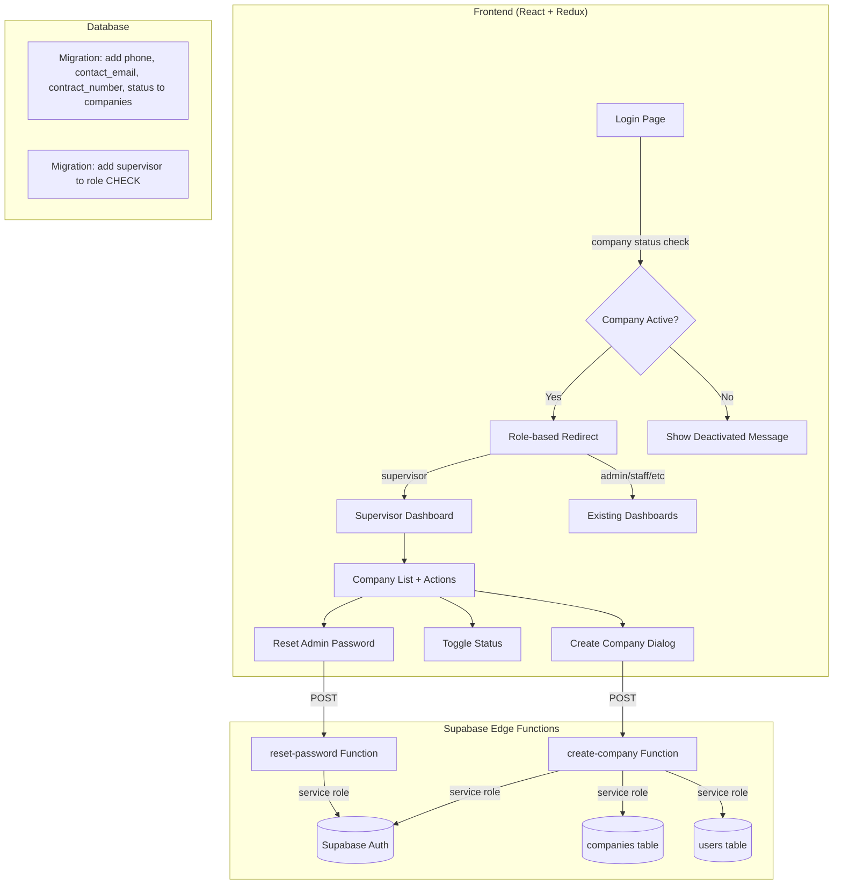

# Design Document: Supervisor Role

## Overview

This design introduces a platform-level `supervisor` role to the leave management system. The supervisor operates outside the company hierarchy — they create companies, provision admin users, toggle company active/disabled status, and reset admin passwords. They have zero access to leave data, staff records, or any company-internal functionality.

The implementation touches every layer of the stack:
- **Database**: New migration adding columns to `companies` and extending the `role` CHECK constraint on `users`
- **Edge Functions**: A new `create-company` function and modifications to the existing `reset-password` function
- **TypeScript types**: `UserRole` union extended, `Company` interface extended
- **Auth flow**: Login checks company `status` before granting access
- **Routing & Layout**: New supervisor routes, sidebar menu, and `ProtectedRoute` support

## Architecture



### Key Design Decisions

1. **Single Edge Function for company creation**: Creating a company requires creating a Supabase Auth user + inserting into `companies` + inserting into `users`. This must happen atomically server-side with the service role key, so a single Edge Function handles the entire flow.

2. **Reuse existing `reset-password` function**: Rather than creating a separate function, we extend the existing one to accept `supervisor` callers with the constraint that they can only target `admin` users.

3. **Company status check at login time**: The `AuthService.signIn` method will query the company's `status` field after successful auth. This is a client-side gate — RLS policies on the database side should also enforce this, but the login UX needs an explicit error message.

4. **Supervisor has no `company_id`**: The supervisor's `company_id` is `null`, which naturally excludes them from all company-scoped queries and RLS policies.

## Components and Interfaces

### New Files

| File | Purpose |
|------|---------|
| `supabase/functions/create-company/index.ts` | Edge Function: creates company + provisions admin |
| `supabase/migrations/2025XXXX_add_supervisor_and_company_fields.sql` | DB migration |
| `src/components/supervisor/Dashboard.tsx` | Supervisor dashboard with company table |
| `src/components/supervisor/index.ts` | Barrel export |
| `src/services/supervisor.ts` | Service layer for supervisor API calls |

### Modified Files

| File | Change |
|------|--------|
| `src/types/index.ts` | Add `supervisor` to `UserRole`, extend `Company` interface |
| `src/utils/roles.ts` | Add `isSupervisor` helper |
| `src/components/common/ProtectedRoute.tsx` | Add `requireSupervisor` prop, redirect supervisor away from non-supervisor routes |
| `src/components/common/Layout/index.tsx` | Add supervisor sidebar menu section |
| `src/App.tsx` | Add supervisor routes, update `resolveDefaultRoute` |
| `src/services/auth.ts` | Add company status check in `signIn` |
| `src/store/slices/organizationSlice.ts` | Add `updateCompanyStatus` thunk |
| `supabase/functions/reset-password/index.ts` | Allow supervisor callers, restrict to admin targets |

### Component Interfaces

```typescript
// Supervisor Dashboard props (none — reads from Redux)
const SupervisorDashboard: React.FC = () => { ... }

// Create Company Dialog
interface CreateCompanyDialogProps {
  open: boolean;
  onClose: () => void;
  onSuccess: () => void;
}

// create-company Edge Function request body
interface CreateCompanyRequest {
  name: string;
  hierarchy_profile: HierarchyProfile;
  phone: string;
  contact_email: string;
  contract_number: string;
}

// create-company Edge Function response
interface CreateCompanyResponse {
  company: Company;
  admin_user_id: string;
}
```

### Service Layer

```typescript
// src/services/supervisor.ts
export const SupervisorService = {
  async createCompanyWithAdmin(data: CreateCompanyRequest): Promise<CreateCompanyResponse>;
  async updateCompanyStatus(companyId: string, status: boolean): Promise<Company>;
  async resetAdminPassword(userId: string): Promise<void>;
  async getCompaniesWithAdmins(): Promise<CompanyWithAdmin[]>;
}
```

## Data Models

### Database Changes (Migration)

```sql
-- Add new columns to companies
ALTER TABLE companies
  ADD COLUMN IF NOT EXISTS phone TEXT,
  ADD COLUMN IF NOT EXISTS contact_email TEXT,
  ADD COLUMN IF NOT EXISTS contract_number TEXT,
  ADD COLUMN IF NOT EXISTS status BOOLEAN NOT NULL DEFAULT true;

-- Extend role CHECK constraint to include 'supervisor'
ALTER TABLE users DROP CONSTRAINT IF EXISTS users_role_check;
ALTER TABLE users ADD CONSTRAINT users_role_check
  CHECK (role IN ('staff', 'manager', 'group_manager', 'general_manager', 'admin', 'supervisor'));
```

### TypeScript Type Changes

```typescript
// Updated UserRole
export type UserRole = 'staff' | 'manager' | 'group_manager' | 'general_manager' | 'admin' | 'supervisor';

// Updated Company interface
export interface Company {
  id: string;
  name: string;
  hierarchy_profile: HierarchyProfile;
  phone?: string;
  contact_email?: string;
  contract_number?: string;
  status: boolean;
  created_at: string;
}

// New: Company with its admin user info (for supervisor dashboard)
export interface CompanyWithAdmin extends Company {
  admin_user?: {
    id: string;
    email: string;
    full_name: string;
  };
}
```

### Edge Function: `create-company`

Request flow:
1. Validate caller is `supervisor` (via auth token → users table lookup)
2. Validate request body (name, hierarchy_profile, phone, contact_email, contract_number)
3. Check `contact_email` doesn't already exist in Supabase Auth
4. Insert company row into `companies` table
5. Create Supabase Auth user with `contact_email` and default password `Pp123456`
6. Insert user row into `users` table with `role: 'admin'`, `company_id`, `requires_password_change: true`
7. If any step fails, clean up (delete auth user if created, delete company if inserted)
8. Return created company + admin user ID


## Correctness Properties

*A property is a characteristic or behavior that should hold true across all valid executions of a system — essentially, a formal statement about what the system should do. Properties serve as the bridge between human-readable specifications and machine-verifiable correctness guarantees.*

### Property 1: isSupervisor correctness

*For any* user object with a randomly generated role from the set of valid UserRole values, `isSupervisor(user)` should return `true` if and only if `user.role === 'supervisor'`.

**Validates: Requirements 1.2**

### Property 2: Supervisor has no company

*For any* user with `role === 'supervisor'`, the `company_id` field must be `null`.

**Validates: Requirements 1.3**

### Property 3: Company creation round-trip

*For any* valid company creation request (name, hierarchy_profile, phone, contact_email, contract_number), calling the create-company Edge Function and then fetching the company should return a company with all provided fields matching, `status` set to `true`, and an associated admin user with `role === 'admin'`, `company_id` matching the new company, `email` matching `contact_email`, and `requires_password_change === true`.

**Validates: Requirements 3.1, 3.2, 3.3**

### Property 4: Company creation form validation

*For any* form submission where at least one required field (name, hierarchy_profile, phone, contact_email, contract_number) is empty or where contact_email is not a valid email format, the form should reject the submission and not call the Edge Function.

**Validates: Requirements 3.6, 3.7**

### Property 5: Company status toggle round-trip

*For any* company and *for any* boolean value `s`, setting the company's status to `s` and then reading the company should return `status === s`.

**Validates: Requirements 4.1, 4.2**

### Property 6: Login blocked for disabled companies

*For any* user with valid credentials, login succeeds if and only if the user's associated company has `status === true` or the user has no associated company (i.e., supervisor). If the company has `status === false`, login is rejected with the message "Your company account has been deactivated. Please contact your administrator."

**Validates: Requirements 5.1, 5.2, 5.3, 5.4**

### Property 7: Supervisor password reset authorization

*For any* target user, a supervisor-initiated password reset succeeds if and only if the target user has `role === 'admin'`. When the target is not an admin, the function returns a 403 error with message "Supervisors can only reset admin passwords." When it succeeds, `requires_password_change` is set to `true` on the target user.

**Validates: Requirements 6.2, 6.3, 6.4, 9.1, 9.2, 9.3**

### Property 8: Supervisor route isolation

*For any* route in the application that is not a supervisor route (`/supervisor/*`), a user with `role === 'supervisor'` should be redirected to `/supervisor/dashboard`.

**Validates: Requirements 7.1, 7.2, 7.4**

### Property 9: Non-supervisor blocked from supervisor routes

*For any* user with a role other than `supervisor`, attempting to access any `/supervisor/*` route should redirect them to their role's default dashboard.

**Validates: Requirements 8.2**

### Property 10: Admin password reset backward compatibility

*For any* admin caller and *for any* target user within the same company, the reset-password Edge Function should continue to reset the password and set `requires_password_change` to `true`, preserving existing behavior.

**Validates: Requirements 9.4**

## Error Handling

| Scenario | Handler | Behavior |
|----------|---------|----------|
| `create-company` called by non-supervisor | Edge Function | 403 Forbidden |
| `create-company` with duplicate email | Edge Function | 400 with "email already in use" message |
| `create-company` partial failure (e.g., auth user created but DB insert fails) | Edge Function | Clean up created auth user, return 500 with descriptive error |
| `reset-password` called by supervisor targeting non-admin | Edge Function | 403 with "Supervisors can only reset admin passwords" |
| `reset-password` called by supervisor with no auth header | Edge Function | 401 Unauthorized |
| Login with disabled company | `AuthService.signIn` | Throw error with deactivation message before returning user data |
| Supervisor navigates to non-supervisor route | `ProtectedRoute` | Redirect to `/supervisor/dashboard` |
| Non-supervisor navigates to supervisor route | `ProtectedRoute` | Redirect to role-specific dashboard |
| Network error on company creation | Supervisor Dashboard | Display error alert, no state change |
| Network error on status toggle | Supervisor Dashboard | Display error alert, revert optimistic update if any |

## Testing Strategy

### Unit Tests

- `isSupervisor` returns correct values for each role
- `resolveDefaultRoute` returns `/supervisor/dashboard` for supervisor role
- `getRoleDashboard` returns correct path for supervisor
- Company creation form validates required fields and email format
- Login component shows deactivation message when company status is false
- Sidebar renders only supervisor menu items for supervisor role

### Property-Based Tests

Library: **fast-check** (TypeScript property-based testing library)

Each property test runs a minimum of 100 iterations.

- **Feature: supervisor-role, Property 1: isSupervisor correctness** — Generate random UserRole values, verify `isSupervisor` returns true iff role is 'supervisor'
- **Feature: supervisor-role, Property 4: Company creation form validation** — Generate random form states with missing/invalid fields, verify rejection
- **Feature: supervisor-role, Property 5: Company status toggle round-trip** — Generate random boolean values, verify set-then-get identity
- **Feature: supervisor-role, Property 6: Login blocked for disabled companies** — Generate random users with random company statuses, verify login outcome matches status
- **Feature: supervisor-role, Property 7: Supervisor password reset authorization** — Generate random target users with random roles, verify reset succeeds iff target is admin
- **Feature: supervisor-role, Property 8: Supervisor route isolation** — Generate random non-supervisor route paths, verify redirect to supervisor dashboard
- **Feature: supervisor-role, Property 9: Non-supervisor blocked from supervisor routes** — Generate random non-supervisor roles, verify redirect away from supervisor routes

### Integration Tests

- End-to-end company creation flow: supervisor creates company → admin user can log in with default password → first-time password change flow works
- Company disable flow: supervisor disables company → company users cannot log in → supervisor re-enables → users can log in again
- Password reset flow: supervisor resets admin password → admin can log in with default password
