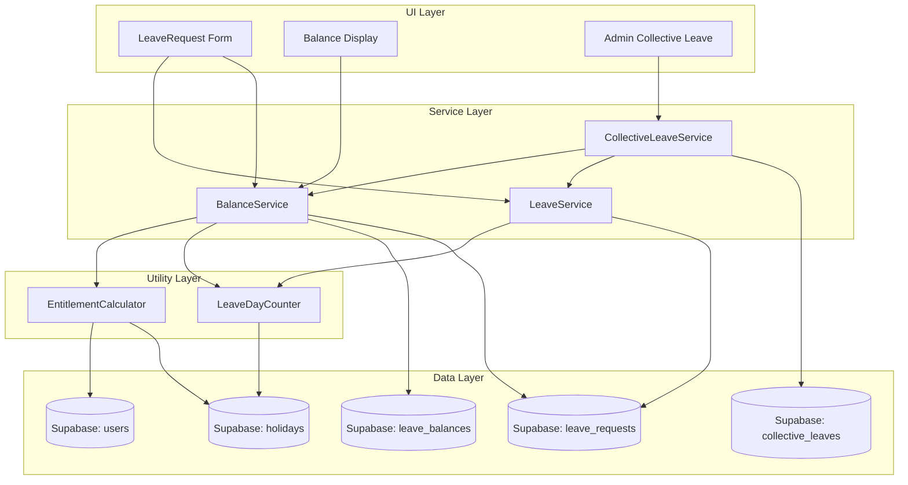

# Design Document: Turkish Annual Leave Law

## Overview

Bu tasarım, Absenta izin yönetim uygulamasına 4857 sayılı İş Kanunu'na uygun yıllık izin hesaplama mantığını ekler. Mevcut sistemdeki sabit `default_days` tabanlı izin tahsisi, kıdem ve yaşa dayalı dinamik hesaplama ile değiştirilecektir.

Temel değişiklikler:
- Kıdeme dayalı izin hak ediş hesaplayıcısı (1-5 yıl: 14 gün, 5-15 yıl: 20 gün, 15+ yıl: 26 gün)
- Yaşa dayalı minimum izin hakkı (≤18 veya ≥50 yaş → minimum 20 gün)
- Tatil günlerinin izin hesaplamasından hariç tutulması
- Toplu izin yönetimi ve negatif bakiye desteği
- İzin devri (carryover) mekanizması
- Detaylı bakiye görüntüleme

## Architecture

Mevcut mimari korunarak yeni modüller eklenecektir. Tüm iş mantığı `src/utils/` ve `src/services/` katmanlarında yer alacak, UI bileşenleri bu servisleri kullanacaktır.



### Design Decisions

1. **Pure function approach for entitlement calculation**: `EntitlementCalculator` fonksiyonları saf (pure) fonksiyonlar olarak tasarlanacak — Supabase'e bağımlılık olmadan `hireDate`, `birthDate`, `periodStart` parametreleri alarak sonuç döndürecek. Bu, test edilebilirliği maksimize eder.

2. **Mevcut `calculateBusinessDays` genişletilecek**: `dateUtils.ts` içindeki mevcut fonksiyon zaten hafta sonu ve tatil hariç tutma mantığını içeriyor. Yeni `LeaveDayCounter` bu fonksiyonu kullanacak, ek olarak çok günlü tatilleri (`holiday_end_date`) destekleyecek.

3. **`leave_balances` tablosu genişletilecek**: Mevcut tablo yapısına `base_entitlement`, `negative_balance` ve `seniority_tier` alanları eklenecek.

4. **Toplu izin için yeni tablo**: `collective_leaves` tablosu oluşturulacak, hedef kapsam (tüm şirket, grup, departman, takım) bilgisi tutulacak.

## Components and Interfaces

### 1. EntitlementCalculator (`src/utils/entitlementCalculator.ts`)

Kıdem ve yaşa dayalı izin hak ediş hesaplama modülü. Tüm fonksiyonlar saf (pure) olup dış bağımlılığı yoktur.

```typescript
interface EntitlementInput {
  hireDate: string;       // ISO date string (YYYY-MM-DD)
  birthDate: string;      // ISO date string (YYYY-MM-DD)
  periodStart: string;    // Leave period start date
}

interface EntitlementResult {
  baseDays: number;           // Kıdeme göre temel izin günü (0, 14, 20, 26)
  seniorityYears: number;     // Toplam kıdem yılı
  seniorityTier: SeniorityTier;
  ageAtPeriodStart: number;   // Dönem başındaki yaş
  isAgeEligible: boolean;     // ≤18 veya ≥50 yaş mı
  finalEntitlement: number;   // max(baseDays, ageMinimum) — son hak ediş
}

type SeniorityTier = 'ineligible' | 'tier1' | 'tier2' | 'tier3';
// ineligible: <1 yıl, tier1: 1-5 yıl (14 gün), tier2: 5-15 yıl (20 gün), tier3: 15+ yıl (26 gün)

function calculateEntitlement(input: EntitlementInput): EntitlementResult;
function calculateSeniorityYears(hireDate: string, referenceDate: string): number;
function getSeniorityTier(seniorityYears: number): SeniorityTier;
function getBaseDaysByTier(tier: SeniorityTier): number;
function calculateAge(birthDate: string, referenceDate: string): number;
function isAgeEligibleForMinimum(age: number): boolean;
```

### 2. LeaveDayCounter (`src/utils/leaveDayCounter.ts`)

İzin günü hesaplama modülü. Mevcut `calculateBusinessDays` fonksiyonunu genişletir.

```typescript
interface LeaveDayCountInput {
  startDate: string;
  endDate: string;
  holidays: Holiday[];
}

function countLeaveDays(input: LeaveDayCountInput): number;
function expandHolidayRanges(holidays: Holiday[]): Set<string>;
function isExcludedDate(date: Date, holidaySet: Set<string>): boolean;
```

### 3. BalanceService Genişletmesi (`src/services/balance.ts`)

Mevcut `BalanceService` genişletilerek kıdem bazlı hesaplama, devir ve negatif bakiye desteği eklenecek.

```typescript
interface EnhancedBalanceSummary extends LeaveBalanceSummary {
  base_entitlement: number;
  carried_over: number;
  negative_from_previous: number;
  seniority_tier: SeniorityTier;
  seniority_years: number;
  age_at_period_start: number;
  is_age_eligible: boolean;
}

// Mevcut getBalances fonksiyonu güncellenerek EntitlementCalculator kullanacak
async function getBalances(userId: string, hireDate: string, birthDate: string, companyId?: string): Promise<EnhancedBalanceSummary[]>;

// Yeni: Devir hesaplama
async function calculateCarryover(userId: string, hireDate: string, birthDate: string, leaveTypeId: string): Promise<number>;
```

### 4. CollectiveLeaveService (`src/services/collectiveLeave.ts`)

Toplu izin yönetimi servisi.

```typescript
interface CollectiveLeaveInput {
  startDate: string;
  endDate: string;
  scope: 'company' | 'group' | 'department' | 'team';
  scopeId: string;        // company_id, group_id, department_id, or team_id
  companyId: string;
  createdBy: string;       // Admin user ID
}

interface CollectiveLeaveResult {
  collectiveLeaveId: string;
  totalDays: number;
  affectedEmployees: number;
  negativeBalanceEmployees: string[];  // IDs of employees who went negative
}

async function createCollectiveLeave(input: CollectiveLeaveInput): Promise<CollectiveLeaveResult>;
async function getCollectiveLeaves(companyId: string): Promise<CollectiveLeave[]>;
```

### 5. UI Components

- **Balance Display Enhancement**: Mevcut bakiye gösterim bileşenleri (`GroupBalances`, `StaffDashboard`) genişletilerek `base_entitlement`, `carried_over`, `negative_from_previous`, `seniority_tier` bilgileri gösterilecek.
- **Collective Leave Admin Page**: `src/components/admin/CollectiveLeave/index.tsx` — Toplu izin oluşturma formu ve geçmiş toplu izinlerin listesi.

## Data Models

### Mevcut `leave_balances` Tablosu Genişletmesi

```sql
ALTER TABLE public.leave_balances
  ADD COLUMN base_entitlement INTEGER NOT NULL DEFAULT 0,
  ADD COLUMN negative_from_previous NUMERIC NOT NULL DEFAULT 0,
  ADD COLUMN seniority_tier TEXT CHECK (seniority_tier IN ('ineligible', 'tier1', 'tier2', 'tier3'));
```

Güncellenmiş tablo yapısı:

| Field | Type | Description |
|---|---|---|
| id | UUID | Primary key |
| user_id | UUID | FK → users |
| leave_type_id | UUID | FK → leave_types |
| period_start | string (date) | İzin dönemi başlangıcı |
| period_end | string (date) | İzin dönemi bitişi |
| allocated_days | number | Toplam tahsis (base + carryover - negative) |
| base_entitlement | number | Kıdeme/yaşa göre temel hak ediş |
| carried_over | number | Önceki dönemden devir |
| negative_from_previous | number | Önceki dönemden negatif bakiye mahsubu |
| seniority_tier | string | Kıdem kademesi |
| created_at | timestamp | Kayıt oluşturma |
| updated_at | timestamp | Son güncelleme |

### Yeni `collective_leaves` Tablosu

```sql
CREATE TABLE public.collective_leaves (
  id UUID PRIMARY KEY DEFAULT gen_random_uuid(),
  company_id UUID NOT NULL REFERENCES public.companies(id),
  start_date DATE NOT NULL,
  end_date DATE NOT NULL,
  total_days NUMERIC NOT NULL,
  scope TEXT NOT NULL CHECK (scope IN ('company', 'group', 'department', 'team')),
  scope_id UUID NOT NULL,
  created_by UUID NOT NULL REFERENCES public.users(id),
  created_at TIMESTAMPTZ DEFAULT NOW()
);
```

| Field | Type | Description |
|---|---|---|
| id | UUID | Primary key |
| company_id | UUID | FK → companies |
| start_date | date | Toplu izin başlangıcı |
| end_date | date | Toplu izin bitişi |
| total_days | number | Hesaplanan iş günü sayısı |
| scope | string | Hedef kapsam türü |
| scope_id | UUID | Hedef kapsamın ID'si |
| created_by | UUID | Oluşturan admin |
| created_at | timestamp | Oluşturma zamanı |

### Mevcut `users` Tablosu Genişletmesi

```sql
ALTER TABLE public.users
  ADD COLUMN birth_date DATE;
```

`birth_date` alanı yaşa dayalı minimum izin hakkı hesaplaması için gereklidir.

### TypeScript Type Güncellemeleri

```typescript
// types/index.ts'e eklenecek
export type SeniorityTier = 'ineligible' | 'tier1' | 'tier2' | 'tier3';

export interface EnhancedLeaveBalanceSummary extends LeaveBalanceSummary {
  base_entitlement: number;
  carried_over: number;
  negative_from_previous: number;
  seniority_tier: SeniorityTier;
  seniority_years: number;
  age_at_period_start: number;
  is_age_eligible: boolean;
}

export interface CollectiveLeave {
  id: string;
  company_id: string;
  start_date: string;
  end_date: string;
  total_days: number;
  scope: 'company' | 'group' | 'department' | 'team';
  scope_id: string;
  created_by: string;
  created_at: string;
}

// User interface'e ekleme
export interface User {
  // ... mevcut alanlar
  birth_date?: string;
}
```


## Correctness Properties

*A property is a characteristic or behavior that should hold true across all valid executions of a system — essentially, a formal statement about what the system should do. Properties serve as the bridge between human-readable specifications and machine-verifiable correctness guarantees.*

### Property 1: Ineligible employees receive zero entitlement

*For any* employee whose seniority (calculated from `hireDate` to `periodStart`) is less than 1 year, the `calculateEntitlement` function shall return `baseDays = 0` and `finalEntitlement = 0`, regardless of age.

**Validates: Requirements 1.1, 1.2**

### Property 2: Seniority tier maps to correct entitlement days

*For any* seniority value ≥ 1 year, the entitlement days shall match the correct tier: 1–5 years (inclusive) → 14 days, more than 5 and less than 15 years → 20 days, 15+ years → 26 days. Formally: `getBaseDaysByTier(getSeniorityTier(seniorityYears))` returns the correct value for all valid seniority inputs.

**Validates: Requirements 2.1, 2.2, 2.3**

### Property 3: Tier boundary applies from next period

*For any* employee whose seniority crosses a tier boundary during a leave period, the entitlement for the current period shall use the tier determined at `periodStart`, not the tier at the boundary crossing date. The new tier shall only apply when `periodStart` falls after the boundary date.

**Validates: Requirements 2.4**

### Property 4: Age-based minimum is the greater of seniority entitlement and 20 days

*For any* eligible employee (seniority ≥ 1 year) who is aged ≤ 18 or ≥ 50 at `periodStart`, the `finalEntitlement` shall equal `max(baseDays, 20)`. For employees not in these age groups, `finalEntitlement` shall equal `baseDays`.

**Validates: Requirements 3.1, 3.2, 3.3**

### Property 5: Leave day count excludes all weekends and holidays

*For any* date range and set of holidays, the `countLeaveDays` function shall return a count that includes only dates which are (a) not Saturday or Sunday and (b) not in the expanded holiday set. Equivalently: for each date in the range, it is counted if and only if it is a weekday and not a holiday.

**Validates: Requirements 4.1, 4.2**

### Property 6: Adding holidays to a leave range does not increase the leave day count

*For any* date range, if we add a holiday that falls on a weekday within that range, the leave day count shall decrease by exactly 1 compared to the count without that holiday. If the holiday falls on a weekend, the count shall remain unchanged.

**Validates: Requirements 4.3**

### Property 7: Collective leave deducts correct days from each targeted employee

*For any* set of targeted employees and a collective leave with `totalDays` working days, after applying the collective leave, each employee's used days shall increase by exactly `totalDays`.

**Validates: Requirements 5.2**

### Property 8: Collective leave creates one approved record per targeted employee

*For any* collective leave application targeting N employees, exactly N leave request records shall be created, each with `status = 'approved'` and `total_days` equal to the collective leave's calculated working days.

**Validates: Requirements 5.3**

### Property 9: Negative balance is preserved when collective leave exceeds available balance

*For any* employee whose remaining balance is less than the collective leave days, the resulting balance shall equal `(previous_remaining - collective_days)`, which is negative. The system shall not reject or clamp the balance to zero.

**Validates: Requirements 6.1**

### Property 10: Negative balance from previous period reduces next period entitlement

*For any* employee with a negative balance `N` from the previous period, the next period's `allocated_days` shall equal `(new_base_entitlement + carryover - |N|)`. The negative amount is subtracted from the new allocation.

**Validates: Requirements 6.2**

### Property 11: Carryover equals unused days from previous period

*For any* employee with a completed previous period, the `carried_over` value for the new period shall equal `max(0, previous_allocated - previous_used)`. If the previous period had a negative remaining balance, `carried_over` shall be 0 and the deficit shall be recorded in `negative_from_previous`.

**Validates: Requirements 7.1, 7.2**

### Property 12: Balance arithmetic consistency

*For any* balance summary, the `remaining` field shall equal `allocated - used - pending`, where `allocated = base_entitlement + carried_over - negative_from_previous`. This arithmetic identity must hold for all balance records.

**Validates: Requirements 8.1**

## Error Handling

| Scenario | Handling | User Feedback |
|---|---|---|
| Employee < 1 year seniority requests annual leave | `BalanceService` rejects with remaining time info | Alert: "Yıllık izin hakkınız henüz başlamadı. Hak kazanma tarihiniz: {date}" |
| `birth_date` is null when calculating age-based minimum | Fall back to seniority-only calculation (no age minimum applied) | No user-facing error; logged as warning |
| Holiday data fetch fails during leave day calculation | Use cached holidays from Redux store; if empty, calculate without holiday exclusion | Warning toast: "Tatil verileri yüklenemedi, hesaplama tatiller hariç tutulmadan yapıldı" |
| Collective leave targets employees with no balance record | Create balance record with 0 base, then apply deduction (resulting in negative) | Admin sees list of employees who went negative |
| Carryover calculation finds no previous period | Set `carried_over = 0` and `negative_from_previous = 0` | No error; first period for employee |
| Concurrent collective leave applications | Use Supabase transaction (RPC) to ensure atomicity | Error if conflict detected: "Toplu izin işlemi çakışması, lütfen tekrar deneyin" |
| Invalid date inputs (hire_date > periodStart) | Return `seniorityYears = 0`, `tier = 'ineligible'` | Validation error on form submission |

## Testing Strategy

### Unit Tests

Unit tests will cover specific examples and edge cases:

- Seniority calculation edge cases: exactly 1 year, exactly 5 years, exactly 15 years (boundary values)
- Age calculation: employee turning 18/50 exactly on period start date
- Leave day counting: ranges that span multiple weekends, ranges with consecutive holidays
- Carryover: first period (no previous), period with zero unused days, period with negative balance
- Collective leave: single employee scope, empty scope (no employees match)

### Property-Based Tests

Property-based tests will use `fast-check` library (to be added as dev dependency) with minimum 100 iterations per property.

Each property test will be tagged with a comment referencing the design property:

```typescript
// Feature: turkish-annual-leave-law, Property 1: Ineligible employees receive zero entitlement
```

Property tests will be organized in:
- `src/utils/entitlementCalculator.test.ts` — Properties 1, 2, 3, 4
- `src/utils/leaveDayCounter.test.ts` — Properties 5, 6
- `src/services/balance.test.ts` — Properties 9, 10, 11, 12
- `src/services/collectiveLeave.test.ts` — Properties 7, 8

### Test Configuration

- Library: `fast-check` (npm package)
- Minimum iterations: 100 per property
- Each property test references its design document property number
- Tag format: `Feature: turkish-annual-leave-law, Property {number}: {property_text}`
