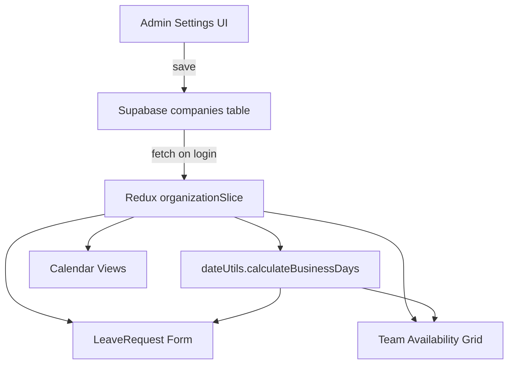

# Design Document: Workday Configuration

## Overview

This feature adds a company-level workday configuration to Absenta, replacing the hardcoded Monday–Friday assumption. An admin selects which days of the week (Sunday=0 through Saturday=6) are workdays via the Settings page. The configuration is stored as an integer array column (`workday_config`) on the existing `companies` table in Supabase, cached in the Redux organization slice, and consumed by the leave calculator, leave request form, team availability grid, and calendar views.

The default when no configuration exists is `[1, 2, 3, 4, 5]` (Monday–Friday), preserving backward compatibility.

## Architecture



The workday configuration flows top-down:
1. Admin persists it to Supabase (`companies.workday_config`).
2. On login (or after admin save), it's fetched into Redux.
3. All consumers read from Redux via a `selectWorkdayConfig` selector that falls back to `DEFAULT_WORKDAYS`.
4. `calculateBusinessDays` and `isWeekend` in `dateUtils.ts` accept the config as a parameter instead of hardcoding Saturday/Sunday.

## Components and Interfaces

### 1. Database Column

Add a `workday_config` column to the `companies` table:
- Type: `integer[]` (Postgres array of smallint)
- Default: `NULL` (application treats NULL as `[1,2,3,4,5]`)
- Constraint: array must not be empty (enforced at application level)

### 2. TypeScript Type Changes

Extend the `Company` interface in `src/types/index.ts`:

```typescript
export interface Company {
  // ...existing fields
  workday_config?: number[]; // 0=Sun, 1=Mon, ..., 6=Sat
}
```

Add a constant:

```typescript
export const DEFAULT_WORKDAYS: number[] = [1, 2, 3, 4, 5];
```

### 3. Redux Slice (`organizationSlice.ts`)

- Add `workdayConfig: number[] | null` to `OrganizationState`.
- Add a `setWorkdayConfig` reducer action for immediate store updates after admin save.
- Add a `selectWorkdayConfig` selector: returns `state.organization.workdayConfig ?? DEFAULT_WORKDAYS`.
- Populate `workdayConfig` from the company record when `fetchCompanies` or `fetchHierarchyProfile` resolves (the company data already comes back with all columns).

### 4. Admin Settings UI (`Settings/index.tsx`)

Add a "Workday Configuration" section below the existing hierarchy profile section:
- Render 7 checkboxes/toggle chips for Monday–Sunday (displayed in locale order starting Monday).
- Load initial state from Redux `selectWorkdayConfig`.
- Validate: at least one day must be checked before enabling Save.
- On save: call `OrganizationService.updateWorkdayConfig(companyId, days)` → update Supabase → dispatch `setWorkdayConfig(days)`.
- Show success/error Snackbar.

### 5. Organization Service (`services/organization.ts`)

Add method:

```typescript
async updateWorkdayConfig(companyId: string, workdayConfig: number[]): Promise<Company>
```

This calls `supabase.from('companies').update({ workday_config: workdayConfig }).eq('id', companyId).select().single()`.

### 6. Date Utilities (`utils/dateUtils.ts`)

Modify `calculateBusinessDays` signature:

```typescript
export const calculateBusinessDays = (
  startDate: Date,
  endDate: Date,
  holidays: Holiday[] = [],
  workdays: number[] = DEFAULT_WORKDAYS
): number
```

Replace the hardcoded `dayOfWeek !== 0 && dayOfWeek !== 6` check with `workdays.includes(dayOfWeek)`.

Similarly update `isWeekend` to accept `workdays` and return `!workdays.includes(date.getDay())`.

### 7. Leave Request Form (`staff/LeaveRequest/index.tsx`)

- Read `workdayConfig` from Redux via `selectWorkdayConfig`.
- Pass it to `calculateBusinessDays` when computing the real-time business day count and when computing `total_days` on submit.

### 8. Team Availability Grid (`manager/Dashboard.tsx`)

- Read `workdayConfig` from Redux.
- Replace the hardcoded Mon–Fri (5 days × 4 weeks) loop with a dynamic loop over `workdayConfig` sorted ascending.
- Table header columns reflect the actual workday names.

### 9. Calendar Views (`CalendarView.tsx`, `ThreeMonthView.tsx`)

- Read `workdayConfig` from Redux.
- In `dayPropGetter`, apply a muted background style to cells whose `date.getDay()` is not in `workdayConfig`.

## Data Models

### Companies Table (modified)

| Column | Type | Default | Description |
|--------|------|---------|-------------|
| workday_config | integer[] | NULL | Array of day-of-week indices (0–6) that are workdays. NULL = use default [1,2,3,4,5]. |

SQL migration:

```sql
ALTER TABLE companies ADD COLUMN workday_config integer[];
```

### Redux State Addition

```typescript
interface OrganizationState {
  // ...existing fields
  workdayConfig: number[] | null;
}
```

### Selector

```typescript
export const selectWorkdayConfig = (state: RootState): number[] =>
  state.organization.workdayConfig ?? DEFAULT_WORKDAYS;
```


## Correctness Properties

*A property is a characteristic or behavior that should hold true across all valid executions of a system — essentially, a formal statement about what the system should do. Properties serve as the bridge between human-readable specifications and machine-verifiable correctness guarantees.*

### Property 1: Workday config round-trip persistence

*For any* non-empty array of unique integers drawn from [0..6], saving it as a company's `workday_config` and then fetching the company record back should return the same array (as a set).

**Validates: Requirements 1.1**

### Property 2: Non-empty workday validation

*For any* subset of [0..6], the validation function should accept the subset if and only if it contains at least one element. Empty arrays must be rejected.

**Validates: Requirements 1.3**

### Property 3: Business day calculation respects workday config and holidays

*For any* start date, end date (where start ≤ end), workday configuration (non-empty subset of [0..6]), and list of holidays, `calculateBusinessDays` should return the count of dates in [start, end] whose day-of-week is in the workday config AND whose date string is not in the holiday set.

**Validates: Requirements 3.1, 3.2**

### Property 4: Business day calculation is order-independent

*For any* date range, holiday list, and two arrays that are permutations of the same workday config, `calculateBusinessDays` should produce identical results for both orderings.

**Validates: Requirements 3.4**

### Property 5: Team availability grid columns match workday config

*For any* workday configuration (non-empty subset of [0..6]), the generated grid column list should contain exactly one column per day in the config, and no columns for days outside the config.

**Validates: Requirements 5.1**

### Property 6: Calendar off-day styling matches workday config

*For any* date and workday configuration, the `dayPropGetter` function should return an off-day style if and only if the date's day-of-week is not present in the workday config.

**Validates: Requirements 6.1**

### Property 7: Workday config selector always returns a valid array

*For any* Redux state where `workdayConfig` is either `null` or a valid integer array, the `selectWorkdayConfig` selector should return a non-empty array of integers from [0..6], falling back to `[1,2,3,4,5]` when the stored value is `null`.

**Validates: Requirements 7.3**

## Error Handling

| Scenario | Handling |
|----------|----------|
| Supabase fetch fails on login | `workdayConfig` stays `null` in Redux; selector returns `DEFAULT_WORKDAYS`. App continues with Mon–Fri. |
| Admin save fails | Show error Snackbar with failure reason. Redux store is not updated. UI reverts to previous state. |
| Admin deselects all days | Save button disabled. Inline validation message: "At least one workday is required." |
| `workday_config` column contains invalid data (e.g., values outside 0–6) | `selectWorkdayConfig` filters to valid indices. If result is empty, falls back to `DEFAULT_WORKDAYS`. |
| `calculateBusinessDays` receives empty workdays array | Returns 0 (no days can be workdays). Callers should use the selector which guarantees non-empty. |

## Testing Strategy

### Property-Based Tests

Use `fast-check` as the property-based testing library (already compatible with the project's Jest/React Testing Library setup).

Each property test runs a minimum of 100 iterations. Each test is tagged with a comment referencing the design property.

| Property | Test Description |
|----------|-----------------|
| Property 1 | Generate random subsets of [0..6], save to mock Supabase, fetch back, assert set equality. |
| Property 2 | Generate random subsets of [0..6] including empty. Assert validation accepts non-empty, rejects empty. |
| Property 3 | Generate random date ranges, workday configs, and holiday lists. Assert `calculateBusinessDays` matches a naive day-by-day count using the same config and holidays. |
| Property 4 | Generate a workday config and a random permutation. Assert both produce the same `calculateBusinessDays` result. |
| Property 5 | Generate random workday configs. Assert the grid column generator produces columns matching the config. |
| Property 6 | Generate random dates and workday configs. Assert `dayPropGetter` returns off-day style iff day-of-week not in config. |
| Property 7 | Generate `null` or random valid arrays for store state. Assert selector returns non-empty valid array. |

Tag format: `// Feature: workday-configuration, Property {N}: {title}`

### Unit Tests

Unit tests complement property tests for specific examples and edge cases:

- Default fallback: `selectWorkdayConfig` returns `[1,2,3,4,5]` when store has `null`.
- Admin UI renders 7 day toggles on load.
- Admin UI pre-checks the correct days from Redux state.
- Save button is disabled when no days are selected.
- Success Snackbar appears after successful save.
- Error Snackbar appears on save failure.
- `calculateBusinessDays` with default config matches legacy behavior (Mon–Fri).
- Leave request form displays correct business day count with a Sunday–Thursday config.
- Team availability grid shows 6 columns for a 6-day workweek config.
- Calendar `dayPropGetter` styles Friday as off-day when config is `[0,1,2,3,4]` (Sun–Thu).
